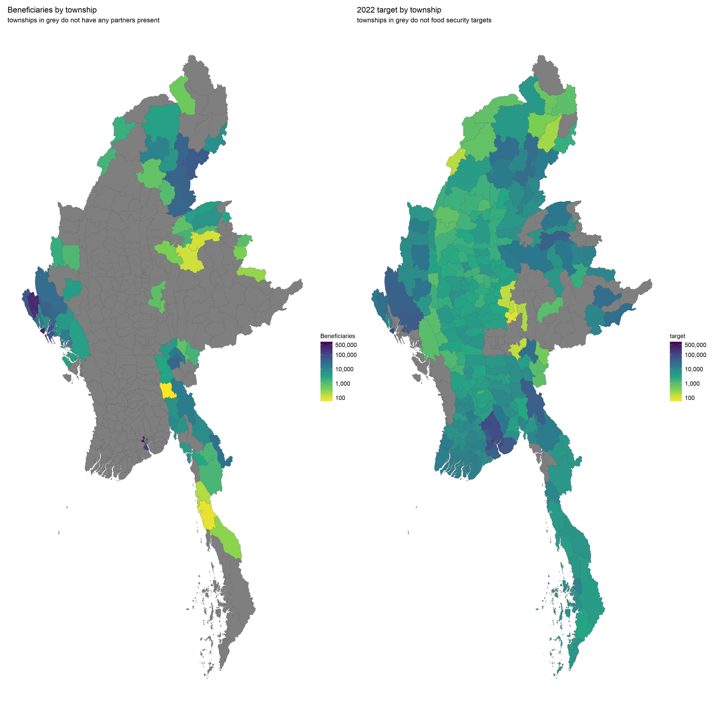
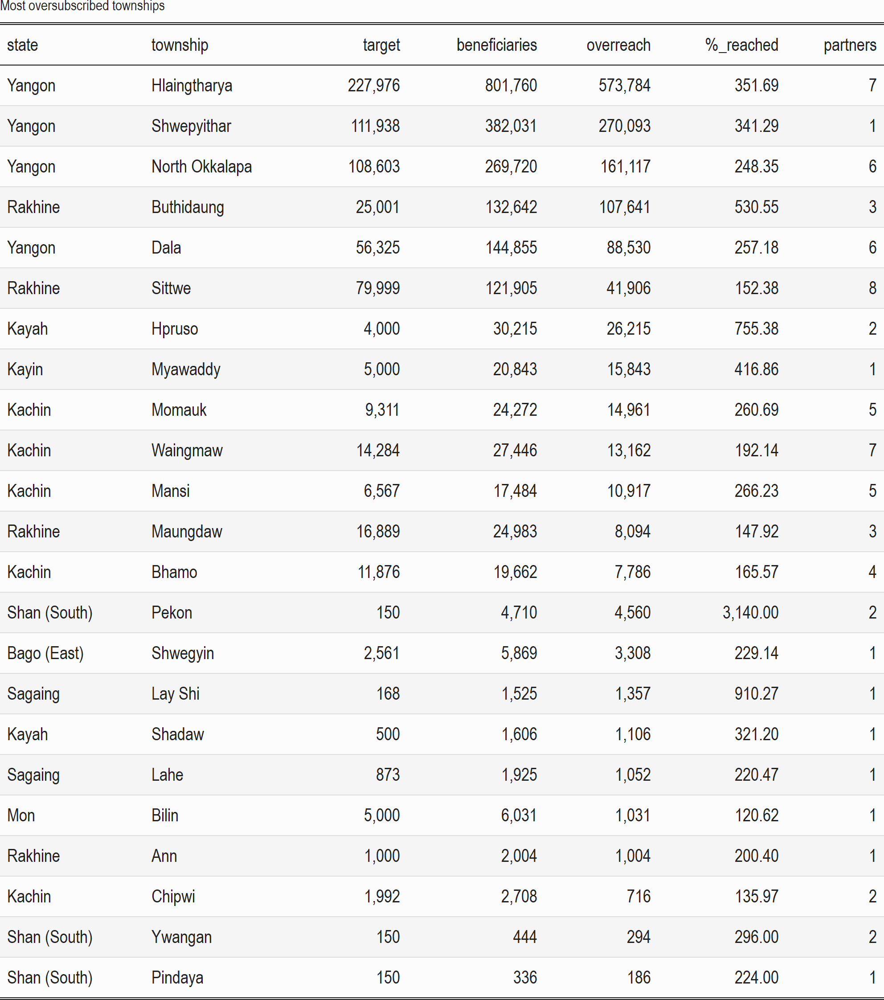

class: center, middle

# 5W results, Q1 2022
### 2022/05/06


```{r setup, include=FALSE}
options(htmltools.dir.version = FALSE)

knitr::opts_chunk$set(echo = FALSE, fig.width=12, message = FALSE, warning=FALSE, 
                      fig.asp = 9/16, fig.align = 'center', out.width = "95%", dpi= 300)
library(tidyverse)
library(readxl)
library(lubridate)
library(stringi)
library(pander)
library(janitor)
library(scales)
library(magrittr)
library(sf)
library(kableExtra)
library(viridis)
library(plotly)
library(patchwork)
library(broom)
library(DT)
library(widgetframe)
theme_set(theme_light())

# disabling scientific notation
options(scipen = 100)

# pander tables all in one row
panderOptions('table.split.table', Inf)

# pander thousands separator
panderOptions("big.mark", ",")

#kable in html 
knitr::kable(head(iris), format = 'html')

# replace 
options(knitr.kable.NA = "")

`%out%` <- Negate(`%in%`)

# function for transposing df
transpose_df <- function(df) {
  t_df <- data.table::transpose(df)
  colnames(t_df) <- rownames(df)
  rownames(t_df) <- colnames(df)
  t_df <- t_df %>%
    tibble::rownames_to_column(.data = .) %>%
    tibble::as_tibble(.)
  return(t_df)
}

# function beneficiary summaries
sum_ben <- function(df, column_var){
  
  column_var <- enquo(column_var)
  
  df %>%
    group_by(!!column_var) %>% # must add bang-bang
    summarise(beneficiaries = sum(new_beneficiaries, na.rm = TRUE)) %>% 
    arrange(desc(beneficiaries))
    
}

# function beneficiary summaries, 2 grouped variables
sum_ben2 <- function(df, column_var1, column_var2){
  
  column_var1 <- enquo(column_var1)
  column_var2 <- enquo(column_var2)
  
  df %>%
    group_by(!!column_var1, !!column_var2) %>% # must add bang-bang
    summarise(beneficiaries = sum(new_beneficiaries, na.rm = TRUE), .groups = "drop")
    
}

# scaling functions 
range01 <- function(x){(x-min(x))/(max(x)-min(x))}
range_wna <- function(x){(x-min(x, na.rm = TRUE))/(max(x, na.rm = TRUE)-min(x, na.rm = TRUE))}

#mode function 
mode <- function(x) {
  ux <- unique(x)
  ux[which.max(tabulate(match(x, ux)))]
}

pcode4 <- read_excel("2022_FSCMYA_5W_template.xlsx", 
           sheet = "GEOADMINS") %>% 
  clean_names() %>% 
  select(admin1pcode_9:admin1_3) %>% 
  rename(admin1_pcode = admin1pcode_9,
         state = state_10, 
         township = township_11,
         admin3_pcode = admin3pcode_12, 
         vt_town = vt_and_town_13, 
         admin4_pcode = vt_and_town_pcode_14)
 
villages <- read_excel("2022_FSCMYA_5W_template.xlsx", 
           sheet = "GEOADMINS") %>% 
  clean_names() %>%
  select(admin1pcode_17:location_type) %>% 
  rename(admin1_pcode = admin1pcode_17,
         state = state_18, 
         township = township_19,
         admin3_pcode = admin3pcode_20, 
         vt_town = vt_and_town_21, 
         admin4_pcode = vt_and_town_pcode_22)

camps <- read_excel("2022_FSCMYA_5W_template.xlsx", 
           sheet = "GEOADMINS") %>% 
  clean_names() %>%
  select(township = township_29, camp_name, pcode_camp = p_code_camp)

industrial_zones <- read_excel("2022_FSCMYA_5W_template.xlsx", 
           sheet = "GEOADMINS") %>% 
  clean_names() %>% 
  select(state = state_36, admin1_pcode = admin1pcode_37, industrial_zone = industrial_zones)

fsc <- read_csv("fsc_codes.csv") %>% 
  rename_all(~str_replace_all(., "^number_of_", "")) %>%
  rename_all(~str_replace_all(., "^number_", "")) %>%
  rename(specify_location = specify_location_if_the_the_location_is_not_in_the_list) %>% 
  mutate(idp_camp_site_name= as.character(idp_camp_site_name)) %>% 
  mutate(location = case_when(!is.na(idp_camp_site_name) ~ idp_camp_site_name,
                              !is.na(village_ward) ~ village_ward,
                              !is.na(specify_location) ~ specify_location,
                              !is.na(village_tract_town) ~ village_tract_town)) %>%
  mutate(date = my(month_of_implementation)) %>% 
  rename(activity = fsc_main_activity) %>% 
  mutate(township = recode(township, "Putao" = "Puta-O"), 
         admin3_pcode = ifelse(township == "Puta-O", "MMR001014", admin3_pcode)) %>% 
  left_join(pcode4 %>% select(township, vt_town, admin3_pcode, admin4_pcode, admin1_pcode), by = 
              c("village_tract_town" = "vt_town", "township" = "township", 
                "admin3_pcode" = "admin3_pcode", "admin1_pcode" = "admin1_pcode")) %>% 
  mutate(total_value_usd = case_when(currency == "MMK" ~ total_value / 1776, 
                                     currency == "USD" ~ total_value)) %>% 
  rename(state = state_region) %>% 
  mutate(admin3_pcode_old = case_when(admin3_pcode %in% c("MMR013046", "MMR013047") ~ "MMR013008", 
                                  admin3_pcode == "MMR015202" ~ "MMR015022",
                                  admin3_pcode == "MMR015315" ~ "MMR015010", 
                                  admin3_pcode == "MMR015312" ~ "MMR015006",	
                                  admin3_pcode == "MMR015308" ~ "MMR015007",
                                  admin3_pcode == "MMR016321" ~ "MMR016003", 
                                  TRUE ~ admin3_pcode)) %>% 
  # removing a duplicate entry from the left join 
  mutate(drop = case_when(admin4_pcode == "MMR007008058" ~ 1, TRUE ~ 0)) %>% 
  rename(response_plan = response_plan_if_project_under_fts, 
         beneficiaries = reached_beneficiaries, 
         households = reached_households) %>% 
  filter(drop != 1) %>% select(-drop) %>% 
  replace_na(list(new_beneficiaries = 0)) %>% 
  mutate(activity_red = case_when(activity %in% c("food distributions (in kind/voucher/cash), moderate", 
                                                  "food distributions (in kind/voucher/cash), severe") ~ 
                                    "food distribution",
                                  activity %in% c("multi-purpose cash transfer (MPC), moderate",
                                                  "multi-purpose cash transfer (MPC), severe") ~ 
                                    "multi-purpose cash transfer",
                                  activity == "livelihoods vocational training" ~ "vocational training",
                                  activity == "food/cash for work/assets" ~ "food_cash for work_assets",
                                  activity == "income-generating activities and small grants" ~ "IGA and small grants", 
                                  TRUE ~ activity), 
         activity_red = str_remove_all(activity_red, "provision of ")) %>%
  mutate(strat_obj = case_when(activity_red %in% c("food distribution", "multi-purpose cash transfer") &
                                 beneficiary_type == "Internally Displaced" ~ 
                          "so_1", 
                        activity_red %in% c("food distribution", "multi-purpose cash transfer") & 
                          beneficiary_type != "Internally Displaced" ~ 
                          "so_2", 
                        TRUE ~ "so_3")) %>% 
   # these partners did not provide the numbers of households
  mutate(households = ifelse(is.na(households), beneficiaries, households)) %>% 
  mutate(usd_per_hhd = total_value_usd / households, 
         usd_per_person = total_value_usd / beneficiaries) %>% 
  mutate(usd_hhd_bin = case_when(usd_per_hhd < 10 ~ "<$10",
                     usd_per_hhd >= 10 & usd_per_hhd < 20 ~ ">=$10_<$20",
                     usd_per_hhd >= 20 & usd_per_hhd < 30 ~ ">=$20_<$30",
                     usd_per_hhd >= 30 & usd_per_hhd < 40 ~ ">=$30_<$40",
                     usd_per_hhd >= 40 & usd_per_hhd < 50 ~ ">=$40_<$50",
                     usd_per_hhd >= 50 & usd_per_hhd < 60 ~ ">=$50_<$60",
                     usd_per_hhd >= 60 & usd_per_hhd < 70 ~ ">=$60_<$70",
                     usd_per_hhd >= 70 & usd_per_hhd < 80 ~ ">=$70_<$80",
                     usd_per_hhd >= 80 & usd_per_hhd < 90 ~ ">=$80_<$90",
                     usd_per_hhd >= 90 & usd_per_hhd < 100 ~ ">=$90_<$100",
                     usd_per_hhd >= 100 ~ ">=$100",
                     TRUE ~ NA_character_),
         usd_hhd_bin = fct_relevel(usd_hhd_bin, c("<$10", ">=$10_<$20", ">=$20_<$30", ">=$30_<$40", ">=$40_<$50",">=$50_<$60", 
                                                  ">=$60_<$70", ">=$70_<$80", ">=$80_<$90",">=$90_<$100",">=$100"))) %>% 
  mutate(usd_person_bin = case_when(usd_per_person < 2 ~ "<$2",
                                 usd_per_person >= 2 & usd_per_person < 4 ~ ">=$2_<$4",
                                 usd_per_person >= 4 & usd_per_person < 6 ~ ">=$4_<$6",
                                 usd_per_person >= 6 & usd_per_person < 8 ~ ">=$6_<$8",
                                 usd_per_person >= 8 & usd_per_person < 10 ~ ">=$8_<$10",
                                 usd_per_person >= 10 & usd_per_person < 12 ~ ">=$10_<$12",
                                 usd_per_person >= 12 & usd_per_person < 14 ~ ">=$12_<$14",
                                 usd_per_person >= 14 & usd_per_person < 16 ~ ">=$14_<$16",
                                 usd_per_person >= 16 & usd_per_person < 18 ~ ">=$16_<$18",
                                 usd_per_person >= 18 & usd_per_person < 20 ~ ">=$18_<$20",
                                 usd_per_person >= 20 ~ ">=$20",
                     TRUE ~ NA_character_), 
         usd_person_bin = fct_relevel(usd_person_bin, c("<$2", ">=$2_<$4", ">=$4_<$6", ">=$6_<$8", ">=$8_<$10",">=$10_<$12", 
                                                  ">=$12_<$14", ">=$14_<$16", ">=$16_<$18", ">=$18_<$20",">=20"))) %>% 
  mutate(location_type = recode(location_type, "village" = "Village"))
 
  
pin <- read_csv("fs_pin.csv") %>% 
  select(-admin1_pcode) %>% 
  left_join(pcode4 %>% distinct(admin1_pcode, state), by = "state")


fsc_2021 <- read_csv("fsc5w_2021.csv") %>%
  mutate(activity_new = 
           case_when(str_detect(activity_description, "Local Chicken support") ~
                       "provision of livestock kits",
                     activity == "Cash for Work / Food for Assets" ~
                       "food/cash for work/assets",
                     str_detect(activity_description, "home|Home") & 
                       !str_detect(activity_description, "training|Training|Training,") ~
                       "provision of kitchen garden kits",
                     activity == "Provide crops & vegetables kits" & 
                       str_detect(activity_description, "pumps|till|drum|Tiller|Drum") ~ 
                       "provision of community infrastructure and equipment",
                     activity == "Provide crops & vegetables kits" ~ 
                       "provision of crop, vegetable and seed kits",
                     activity == "Provide fishery kits" ~ 
                       "provision of fishery kits",
                     activity == "Provide livestock kits" ~ 
                       "provision of livestock kits",
                     activity %in% c("Provide monthly cash-based transfers", "Provide monthly food baskets") & 
                       str_detect(activity_description, "Lifesaving|lifesaving|acute|Acute") ~ 
                       "food distributions (in kind/voucher/cash), severe",
                     # what to do about MVC, malnourished children and PLW?
                     activity %in% c("Provide monthly cash-based transfers", "Provide monthly food baskets")  ~
                       "food distributions (in kind/voucher/cash), moderate",  
                     activity == "Provide support for income generation" & 
                       !str_detect(activity_description, "agriculture input|farming") ~
                       "income-generating activities and small grants",
                     activity  == "Provide support for income generation"  ~
                       "income-generating activities and small grants",
                     activity == "Provide technical training" & str_detect(activity_description,
                                               "farm|Farm|FFS|pesticide|ferti|agri|Agri|gardening|Seed|seed|SSA") ~
                       "FFS and farmer training",
                     activity == "Provide technical training" ~ "vocational training",
                     activity_description %in% c("Provide Voucher Cards to buy agriculture inputs for their agricultural works",
                                                 "Cash for farming (Livestock and Agri)") ~
                       "provision of crop, vegetable and seed kits", 
                     TRUE ~ NA_character_)) %>% 
   mutate(activity_red = case_when(activity_new %in% c("food distributions (in kind/voucher/cash), moderate",
                                                   "food distributions (in kind/voucher/cash), severe") ~
                                     "food distribution",
                                  activity_new %in% c("multi-purpose cash transfer (MPC), moderate",
                                                  "multi-purpose cash transfer (MPC), severe") ~ 
                                    "multi-purpose cash transfer",
                                  activity == "livelihoods vocational training" ~ "vocational training",
                                  activity == "food/cash for work/assets" ~ "food_cash for work_assets",
                                  activity == "income-generating activities and small grants" ~ "IGA and small grants",
                                  TRUE ~ activity_new)) %>% 
  mutate(strat_obj = case_when(activity_red %in% c("food distribution", "multi-purpose cash transfer") & 
                          beneficiary_type == "Internally Displaced" ~ 
                          "so_1", 
                        activity_red %in% c("food distribution", "multi-purpose cash transfer") & 
                          beneficiary_type != "Internally Displaced" ~ 
                          "so_2", 
                        TRUE ~ "so_3")) %>% 
  mutate(activity_red = recode(activity_red, 
                                       "food/cash for work/assets" = "food_cash for work_assets", 
                                       "provision of crop, vegetable and seed kits" = "crop, vegetable and seed kits",
                                       "provision of livestock kits" = "livestock kits",
                                       "income-generating activities and small grants" = "IGA and small grants"), 
         activity_red = str_remove_all(activity_red, "provision of "))

# shapefiles
pcode3_shape <- st_read("./mmr_polbnda_adm3_mimu_250k/mmr_polbnda_adm3_mimu_250k.shp", quiet = TRUE) %>%
  rename(state = ST, 
        admin1_pcode = ST_PCODE,
        township = TS,
        admin3_pcode = TS_PCODE) %>% 
 mutate(admin3_pcode = ifelse(str_detect(township, "Hlaingtharya"), "MMR013008", admin3_pcode))

pcode1_shape <- st_read("./mmr_polbnda2_adm1_mimu_250k/mmr_polbnda2_adm1_mimu_250k.shp", quiet = TRUE) %>% 
 rename(state = ST, 
        admin1_pcode = ST_PCODE) %>% st_as_sf()
```


---
class: center, middle

### Summary of achievements

```{r}
fsc %>% 
  sum_ben2(strat_obj, humanitarian_or_development) %>% 
  ungroup() %>%
  pivot_wider(names_from = humanitarian_or_development, values_from = beneficiaries, values_fill = 0) %>% 
  mutate(strat_obj = fct_relevel(strat_obj, levels = c("so_1", "so_2", "so_3")), 
         Total = Development + Humanitarian) %>% 
  adorn_totals("row") %>% 
  kable(caption = "2022 beneficiaries by strategic objective", format.args = list(big.mark = ","), format = "html") %>% 
  kable_classic_2("striped", full_width = FALSE)
```


---
class: center, middle

### Breakdown by activity

```{r}
fsc %>%  
  sum_ben2(strat_obj, activity_red) %>% 
  arrange(desc(beneficiaries)) %>% 
  pivot_wider(names_from = strat_obj, values_from = beneficiaries, values_fill = 0, names_prefix = "ben_") %>% 
  mutate(Total = ben_so_1 + ben_so_2 + ben_so_3, 
         `%_ben` = round(Total / sum(Total) * 100, digits = 2)) %>% 
  relocate(ben_so_1, .after = activity_red) %>% 
  rename(activity = activity_red) %>% 
  kable(caption = "Breakdown of beneficiaries by activity", format.args = list(big.mark = ","), format = "html") %>% 
  kable_classic_2("striped")
```

---
class: center, middle

### Breakdown by state

```{r fig.height = 6, dpi = 300}
fsc %>% 
  group_by(state, admin1_pcode) %>% 
  summarise(beneficiaries = sum(new_beneficiaries), .groups = "drop") %>% 
  ungroup() %>% 
  left_join(pin %>% group_by(admin1_pcode) %>% summarise(target = sum(fs_targeted, na.rm = TRUE)),
            by = "admin1_pcode") %>% 
  mutate(state = fct_reorder(state, -beneficiaries),
         pc_reached = beneficiaries / target) %>%
  arrange(desc(pc_reached)) %>% 
  ggplot(aes(x = state, y = beneficiaries, fill = pc_reached)) + 
  geom_col() +
  geom_text(aes(label = comma(beneficiaries)), size = 3, vjust = -0.5) +
  scale_y_continuous(labels = comma) +
  scale_fill_viridis(labels = percent, direction = -1, option = "mako") +
  theme(axis.text.x = element_text(angle = 30, vjust = 0.7)) +
  labs(x = "", y = "Beneficiaries", fill = "% of\ntarget",
       title = "Number of beneficiaries reached by state, Food Security Cluster",
       subtitle = "and percentage of target reached") 
```

---

```{r}
state_ord <- fsc %>% 
  group_by(state, admin1_pcode) %>% 
  summarise(beneficiaries = sum(new_beneficiaries, na.rm = TRUE)) %>% 
  arrange(desc(beneficiaries)) %>% 
  rbind(tribble(~state, ~admin1_pcode, ~beneficiaries,
                "Ayeyarwady", NA_character_, NA_real_,
                "Magway", NA_character_, NA_real_,
                "Mandalay", NA_character_, NA_real_))

state_ord_2021 <- fsc_2021 %>% 
  filter(unique_beneficiaries == "Yes") %>% 
  group_by(state, admin1_pcode) %>% 
  mutate(admin1_pcode = ifelse(state == "Tanintharyi", "MMR006", admin1_pcode)) %>%
  summarise(beneficiaries = sum(beneficiaries)) %>% 
  left_join(fsc %>% 
              group_by(admin1_pcode) %>%
              summarise(beneficiaries_2022 = sum(new_beneficiaries, na.rm = TRUE)),
            by = "admin1_pcode") %>% 
  arrange(desc(beneficiaries_2022))

fsc %>% 
  group_by(state, humanitarian_or_development) %>% 
  summarise(beneficiaries = sum(new_beneficiaries, na.rm = TRUE), .groups = "drop") %>% 
  pivot_wider(names_from = humanitarian_or_development, values_from = beneficiaries) %>%
  rowwise() %>% 
  mutate(beneficiaries = sum(Humanitarian, Development, na.rm = TRUE)) %>% 
  ungroup() %>% 
  mutate(pc_2022 = round(beneficiaries / sum(beneficiaries) * 100, digits = 2)) %>% 
  right_join(fsc_2021 %>% 
              filter(unique_beneficiaries == "Yes") %>% 
              group_by(state) %>%
              summarise(beneficiaries_2021 = sum(beneficiaries)) %>%
              mutate(pc_2021 = round(beneficiaries_2021 / sum(beneficiaries_2021) * 100, digits = 2)),
            by = "state") %>% 
  arrange(desc(pc_2022)) %>% 
  select(State = state, Beneficiaries_2021 = beneficiaries_2021, `%_ben_2021` = pc_2021, 
         Beneficiaries_2022 = beneficiaries, `%_ben_2022` = pc_2022) %>% 
  kable(caption = "Skew in Q1 2022 geographic reach, comparison with 2021 data", format.args = list(big.mark = ","), 
        format = "html") %>%
  column_spec(3, color = "white", background = spec_color(state_ord_2021$beneficiaries[1:16], end = 0.8, direction = -1)) %>%
  column_spec(5, color = "white", background = spec_color(state_ord$beneficiaries[1:16], end = 0.8, direction = -1)) %>%
  kable_classic_2("striped")
```

---
class: center, middle
### Top townships by beneficiaries reached

```{r}
tsp_ord <- fsc %>%
  group_by(township) %>% 
  summarise(beneficiaries = sum(new_beneficiaries, na.rm = TRUE)) %>% 
  mutate(township = case_when(beneficiaries <= 30215 ~ "55 other townships", 
                              TRUE ~ township)) %>% 
  group_by(township) %>% 
  summarise_all(.funs = sum) %>% arrange(desc(beneficiaries))

fsc %>%  
  group_by(state, township, humanitarian_or_development) %>% 
  summarise(beneficiaries = sum(new_beneficiaries, na.rm = TRUE), .groups = "drop") %>% 
  mutate(humanitarian_or_development = str_to_lower(humanitarian_or_development)) %>%
  pivot_wider(names_from = humanitarian_or_development, values_from = beneficiaries) %>% 
  rowwise() %>% 
  mutate(beneficiaries = sum(development, humanitarian, na.rm = TRUE)) %>% 
  mutate(township = case_when(beneficiaries <= 30215 ~ "55 other townships", 
                              TRUE ~ township), 
         state = case_when(beneficiaries <= 30215 ~ NA_character_, 
                              TRUE ~ state)) %>% 
  group_by(state, township) %>% 
  summarise(beneficiaries = sum(beneficiaries, na.rm = TRUE),
            humanitarian = sum(humanitarian, na.rm = TRUE),
            development = sum(development, na.rm = TRUE), .groups = "drop") %>% 
  mutate(pct_of_total = round(beneficiaries / sum(beneficiaries) * 100, digits = 2)) %>% 
  arrange(desc(pct_of_total)) %>% 
  select(State = state, Township = township, Humanitarian = humanitarian, Development = development,
         Beneficiaries = beneficiaries, `%_Total` = pct_of_total) %>% 
  kable(caption = "Top 7 townships by beneficiaries reached (desc)", format.args = list(big.mark = ","), 
        format = "html") %>% 
  column_spec(6, color = "white", background = spec_color(tsp_ord$beneficiaries[1:8], end = 0.8, direction = -1)) %>%
  kable_classic_2(lightable_options = c("striped")) %>% 
  footnote("The 55 other townships are each less than 1.5% of the total", 
           general_title = "")

```


---
class: center, middle
### Monthly progress by activity

```{r fig.height=6, dev='svg'}
fsc %>% 
  group_by(date, activity_red) %>% 
  summarise(beneficiaries = sum(new_beneficiaries)) %>% 
  rbind(fsc_2021 %>% 
          filter(unique_beneficiaries == "Yes") %>%
          group_by(date, activity_red) %>% 
          summarise(beneficiaries = sum(beneficiaries))) %>% 
  group_by(activity_red) %>% 
  arrange(date) %>% 
  mutate(cum_ben = cumsum(beneficiaries)) %>% 
  arrange(activity_red) %>% 
  mutate(activity_red = str_replace_all(activity_red, "provision of ", "")) %>%
  ggplot(aes(x = date, y = cum_ben, colour = activity_red)) +
  geom_vline(colour = "red", lty = 2, xintercept = as.numeric(as.Date("2022-01-01")), alpha = 0.5) +
  geom_vline(colour = "red", lty = 2, xintercept = as.numeric(as.Date("2021-06-01")), alpha = 0.5) +
  geom_line(size = 0.7) +
  scale_x_date(date_breaks = "1 month", date_labels = "%b") +
  scale_y_continuous(labels = comma) +
  facet_wrap(~ activity_red, scales = "free_y") +
  theme(legend.position = "none",
        axis.text.x = element_text(size = 5, angle = 60)) + # see if this works when you knit, then do it for the other plots 
  labs(x = "Month", 
       y = "Cumulative beneficiaries", 
       title = "Monthly progress by activity, 2021-2022",
       subtitle = "Figures are in cumulative unique beneficiaries reached") + 
  theme(plot.title = element_text(size = 12))
```

---
class: center, middle
### Delivery modalities

```{r fig.height=6, dev='svg'}
state_totals <- fsc %>% 
  filter(!is.na(delivery_modality)) %>% 
  group_by(state) %>% 
  summarise(total = sum(new_beneficiaries)) %>% 
  mutate(pc = 1, 
         state = fct_reorder(state, total))

fsc %>%  
  filter(!is.na(delivery_modality)) %>%  
   mutate(delivery_modality = case_when(str_detect(delivery_modality, "Hybrid") ~ "Hybrid", 
                                       str_detect(delivery_modality, "Service") ~ "Service delivery", 
                                       TRUE ~ delivery_modality)) %>%
  group_by(state, delivery_modality) %>% 
  summarise(beneficiaries = sum(beneficiaries)) %>% 
  group_by(state) %>% 
  mutate(pc = beneficiaries / sum(beneficiaries),
         state = fct_reorder(state, beneficiaries)) %>% 
  ggplot(aes(x = pc, y = fct_rev(state), fill = delivery_modality)) + 
  geom_col() +
  scale_x_continuous(labels = percent, breaks = seq(0, 1, by = .2)) + 
  geom_text(aes(y = state, x = pc + 0.12, label = comma(total, accuracy = 1), fill = NULL), 
            data = state_totals, hjust = "inward", size = 3.5) +
  labs(x = "% of total", y = "", fill = "", 
       title = "Percentage of beneficiaries reached by delivery modalities", 
       subtitle = "State beneficiary totals at the end of each bar")
```


---

class: center, middle
### Average cash transfer values 

```{r fig.height=5, dev='svg'}
fsc %>%
  filter(!is.na(usd_per_hhd) & !is.na(new_beneficiaries)) %>% 
  filter(delivery_modality %in% c("CBT/CVA", "Hybrid (In-kind & CBT/CVA)")) %>%
  group_by(usd_hhd_bin) %>% 
  summarise(households = sum(households)) %>% 
  mutate(`%_of_hhd` = round(households / sum(households) * 100, digits = 2)) %>% 
  ggplot(aes(x = usd_hhd_bin, y = households, fill = usd_hhd_bin)) + 
  geom_col() + 
  geom_text(aes(label = `%_of_hhd`), vjust = -0.4, size = 3) + 
  scale_fill_viridis_d(option = "mako", direction = -1) + 
  scale_y_continuous(labels = comma, breaks = seq(0, 80000, by = 10000)) + 
  theme(legend.position = "none", 
        axis.text.x = element_text(angle = 30, hjust = 0.8, vjust = 0.9)) +
  labs(x = "USD value of cash transfer per household per month",
       y = "Number of households",
       title = "Number of households by value of cash transfer per household (2022 1Q)",
       subtitle = "Figures at the top of each bar show percentage of households\nOnly households reached through the cash, hybrid or voucher modalities are included")
```

---
class: center, middle
### Cash transfer values per person 

```{r fig.height=6, dev='svg'}
fsc %>% filter(!is.na(total_value_usd) & activity_red != "livestock kits") %>%
  ggplot(aes(y = activity_red, x = usd_per_person, colour = activity_red)) + 
  geom_jitter(alpha = .1, aes(size = beneficiaries)) +
  geom_boxplot(alpha = .8) + 
  scale_x_continuous(trans = "log10", breaks = c(0, 1, 3, 10, 30, 100, 300), 
                     labels = dollar_format(accuracy = 1)) +
  theme(legend.position = "none") +
  labs(x = "USD per person", y = "", 
       title = "Boxplots of USD transfer values per person", 
       subtitle = "Thick line in each box is the mean;\n Points are individual distributions, sizes of points reflect beneficiaries")
```

---
class: center, middle

```{r}
money_scatter <- fsc %>% 
  filter(!is.na(total_value_usd) & activity_red != "livestock kits") %>%
  group_by(state, township, location, org_code, activity_red) %>% 
  summarise(beneficiaries = sum(beneficiaries), 
            total_value_usd = sum(total_value_usd), 
            rounds = n_distinct(date)) %>% 
  mutate(per_person = round(total_value_usd / beneficiaries, digits = 2)) %>% 
  filter(total_value_usd > 0) %>%
  ggplot(aes(x = beneficiaries, y = per_person, colour = activity_red, 
             text = paste0(org_code, "\n", 
                           activity_red, "\n", 
                           "ben. frequencies: ", comma(beneficiaries, accuracy = 1), "\n",
                           "USD per person: ", dollar(per_person), "\n", 
                           "total value: ", dollar(total_value_usd, accuracy = 1), "\n", 
                           "rounds: ", rounds, "\n", 
                           township, ", ", state))) + 
  geom_jitter(aes(size = beneficiaries), alpha = .5) + 
  scale_y_continuous(trans = "log10", breaks = c(0, 1, 3, 10, 30, 100, 300), labels = dollar_format(accuracy = 1)) + 
  scale_x_continuous(trans = "log10", labels = comma, breaks = c(0, 10, 100, 1000, 10000, 100000, 300000)) + 
  scale_size_continuous(guide = "none", range = c(0.3, 10)) + 
  labs(x = "Beneficiary frequencies", 
       y = "USD transfer value per person", 
       title = "Average USD transfer value per person", 
       subtitle = "By organisation, location and activity", 
       colour = "") + 
  theme(legend.text = element_text(size = 5)) + 
  guides(colour = guide_legend(override.aes = list(size = 1, alpha = 1)))

ggplotly(money_scatter, tooltip = c("text"), width = 800, height = 500) %>% 
  layout(title = list(text = paste0("Average USD transfer value per person",
                                    "<br>",
                                    "<sup>",
                                    "By organisation, location and activity; double-click on legend to select","</sup>")))
```

---
class: center, middle

```{r}
food_dist_range <- fsc %>% 
  filter(!is.na(usd_per_person)) %>%
  filter(activity_red == "food distribution" & usd_per_person < 60) %>% 
  ggplot(aes(x = usd_per_person, y = state, colour = state, 
             text = paste0(org_code, "\n", 
                           activity_red, "\n", 
                           "ben. frequencies: ", comma(beneficiaries, accuracy = 1), "\n",
                           "USD per person: ", dollar(usd_per_person), "\n", 
                           "total value: ", dollar(total_value_usd, accuracy = 1), "\n",
                           township, ", ", state))) + 
  geom_vline(xintercept = 11.455, lty = 2, colour = "red", alpha = .5, size = .3) + 
  geom_jitter(alpha = 0.3, aes(size = beneficiaries)) +
  scale_colour_viridis_d() +
  scale_size_continuous(range = c(0.3, 10)) +
  scale_x_continuous(breaks = seq(0, 90, by = 10), labels = dollar_format(accuracy = 1)) +
  labs(x = "USD value per person", 
       y = "", 
       title = "Food distribution: range of USD values per person by state",
       size = "", colour = "") 

ggplotly(food_dist_range, tooltip = c("text"), width = 800, height = 500) %>% 
  layout(title = list(text = paste0("Food distribution: range of USD values per person by state",
                                    "<br>",
                                    "<sup>",
                                    "The red line is 50% of food MEB; double-click on legend to select","</sup>")))
```

---
class: center, middle
### Breakdown by beneficiary type

```{r fig.height=6, dev='svg'}
fsc %>% 
  group_by(beneficiary_type) %>% 
  summarise(beneficiaries = sum(new_beneficiaries)) %>% 
  mutate(beneficiary_type = fct_reorder(beneficiary_type, -beneficiaries)) %>% 
  ggplot(aes(x = beneficiary_type, y = beneficiaries, fill = beneficiary_type)) + 
  geom_col() +
  geom_text(aes(label = comma(beneficiaries)), size = 5, vjust = -0.5) +
  scale_y_continuous(labels = comma) +
  scale_fill_discrete(guide = "none") +
  theme(axis.text.x = element_text(size = 10)) + 
  labs(x = "Beneficiary type",
       y = "Number of beneficiaries", 
       subtitle = "Persons reached by beneficiary type")
```

---
class: center, middle
### Evidence of food insecurity 

```{r}
fsc %>%  
  mutate(has_evidence = ifelse(is.na(evidence), "no", "yes"), 
         food_insecurity_status = ifelse(is.na(food_insecurity_status), "No status provided", food_insecurity_status), 
         food_insecurity_status = fct_relevel(food_insecurity_status, "No status provided", after = Inf)) %>% 
  group_by(food_insecurity_status) %>% 
  summarise(beneficiaries = sum(new_beneficiaries)) %>% 
  mutate(`%_benficiaries` = round(beneficiaries / sum(beneficiaries) * 100, digits = 2)) %>% 
  kable(caption = "Breakdown by food insecurity status", 
        format.args = list(big.mark = ","), format = "html") %>% 
  kable_classic_2(full_width = FALSE)
```

---
class: center, middle 

```{r}
partner_scatter <- fsc %>%  
  group_by(org_code) %>% 
  summarise(states = n_distinct(state), 
            townships = n_distinct(admin3_pcode), 
            beneficiaries = sum(new_beneficiaries)) %>% 
  ggplot(aes(x = beneficiaries, y = townships, text = org_code, 
             text = paste0(org_code, "\n",  
                           "beneficiaries: ", comma(beneficiaries, accuracy = 1), "\n",
                           "townships: ", townships))) + 
  geom_point(aes(size = beneficiaries), alpha = .7) + 
  scale_x_continuous(trans = "log", labels = comma, breaks = c(0, 100, 300, 1000, 3000, 10000, 100000, 300000)) +
  scale_y_continuous(breaks = seq(0, 25, 5)) +
  labs(x = "Number of beneficiaries",
       y = "Number of townships",
       title = "Plot of beneficiaries and townships reached, by implementing partner") +
  theme(legend.position = "none")

ggplotly(partner_scatter, tooltip = c("text"), width = 800, height = 500) %>%
  config(displayModeBar = FALSE) %>% 
  layout(title = list(text = paste0("Plot of beneficiaries and townships reached, by implementing partner",
                                    "<br>", 
                                    "<sup>",
                                    "mouse over for details",
                                    "</sup>")))
```

---
class: center, middle 

```{r}
ben_target <- fsc %>% 
  group_by(admin3_pcode_old) %>% 
  summarise(beneficiaries = sum(new_beneficiaries),
            partners = n_distinct(org_code)) %>% 
  left_join(pin, by = c("admin3_pcode_old" = "admin3_pcode")) %>% 
  mutate(reached_pc = beneficiaries / fs_targeted,
         reached_pc = ifelse(is.infinite(reached_pc), 1, reached_pc),
         fs_targeted = ifelse(fs_targeted == 0 & beneficiaries > 0, 1, fs_targeted),
         fs_targeted = round(fs_targeted, digits = 0)) %>% 
  arrange(desc(reached_pc)) %>% 
  select(state, township, fs_pin, fs_targeted, beneficiaries, reached_pc, partners) %>%
  ggplot(aes(x = fs_targeted, y = beneficiaries, colour = partners, 
             text = paste0(township, ",", "\n",
                           state, ",", "\n",
                           "beneficiaries: ", comma(beneficiaries, accuracy = 1), "\n",
                           "target: ", comma(fs_targeted, accuracy = 1), "\n",
                           "% of target: ", percent(reached_pc, accuracy = 2), "\n", 
                           "partners: ", partners))) + 
  geom_abline(intercept = 0, slope = 1, lty = 2, colour = "red") + 
  geom_point(aes(size = beneficiaries), alpha = 0.8) +
  scale_size_continuous(guide = "none") + 
  scale_x_continuous(trans = "log10", labels = comma) + 
  scale_y_continuous(trans = "log10", labels = comma) +
  scale_colour_viridis(direction = -1) +
  labs(x = "Targeted population", y = "Beneficiaries", 
       title = "Beneficiaries reached vs targeted population by township, Q1 2022",
       subtitle = "The red line is 100% of target")

ggplotly(ben_target, tooltip = c("text"), width = 800, height = 500) %>% 
  layout(title = list(text = paste0("Beneficiaries reached vs targeted population by township, Q1 2022",
                                    "<br>",
                                    "<sup>",
                                    "The red line is 100% of target; size indicates number of beneficiaries","</sup>")))
```

---


class: center, middle
```{r out.height= "85%", out.width="85%"}

```


---
class: center, middle



---
class: center, middle


